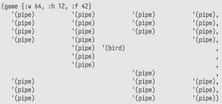

# Terminal Flappy bird but it's HOMOICONIC™ 

This is a flappy bird game rendered through text, but with a twist: the
TEXT IS THE ACTUAL CODE THAT GETS EVALUATED(powered by Clojure™)

The runner reads text and interprets it as a frame, then it outputs the next frame
, reads it, interprets, outputs next frame and so on and so on.

The only thing required is a valid initial frame.

# Running the game

`clj -M runner.clj`
